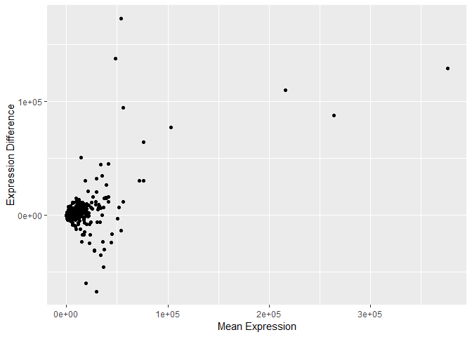
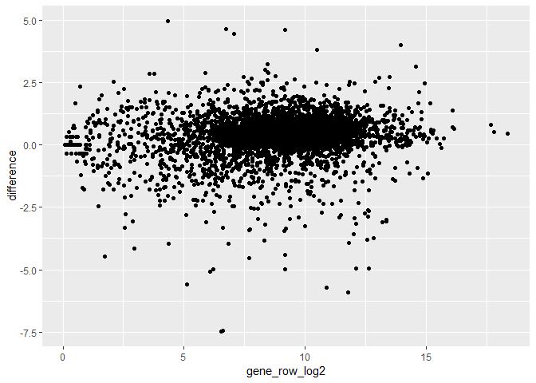

JN\_Bio720\_Assignment3
================
Jalees Nasir
November 1, 2018

R assignment number three due Monday November 5th.
==================================================

Control flow and summarizing data
---------------------------------

[Here is a link](https://www.dropbox.com/s/gqu520cc6r7xjw4/eXpress_dm_counts.csv?dl=0) to some data that was used in a [recent paper](https://onlinelibrary.wiley.com/doi/abs/10.1111/mec.14907) from our lab using RNA-seq to help understand the relationship between condition dependence and sexual dimorphism using the Asian Rhinocerous beetle. This data is a set of counts of expression values after mapping reads to the beetle transcriptome, and identifying orthologs (in this case to *Drosophila*), Each row (FBpp) represents a distinct polypeptide (which is how we identified orthology between the beetles and the flies), and each column are the estimated counts from the RNA-seq data for the given gene for a given sample. So all counts on a single row are for the same gene (but across samples), while all counts within a single column are for all of the genes within an individual sample.

Sample names (column names) have identifiers about the individual, nutritional treatment, sex and tissue each seperated by an underscore.

So F101\_lg\_female\_hdhorn is individual F101, from the high nutrition (lg is for large, since the animals are bigger with better food), a female, and from the head horn tissue. While M120\_sm\_male\_genitalia is individual 120, low nutrition (small), male from the genitalia tissue.

Two nutritional treatments (lg and sm) four tissues (only three in females) hdhorn (head horn), thoracic horn (thxhorn), wing and genitalia.

For this assignment I want you to use your knowledge of control flow, writing functions, and performing repeated operations (using loops and/or apply family of functions) to generate some summaries.

1.  Read in the `.csv` file (call it rna\_counts). Write a function that calculates and can output mean expression (using the `mean()` function) for a given data column. Write this function so that it can work on either raw counts (as provided) or transformed to log2 values of the counts, with a logical argument that allows the user to choose whether to do this on the raw scale or log2 scale (i.e. log2 transform, then calculate the mean). Make sure all functions you write for this assignment have this argument. We often use log2 scale for RNAseq data. Demonstrate that it works on several of the columns of data.

``` r
library(dplyr)
```

    ## 
    ## Attaching package: 'dplyr'

    ## The following objects are masked from 'package:stats':
    ## 
    ##     filter, lag

    ## The following objects are masked from 'package:base':
    ## 
    ##     intersect, setdiff, setequal, union

``` r
library(ggplot2)
```

``` r
#Open data on work laptop: main device used for the course
#rna_counts <- read.csv("C://Users/jalee/Documents/R/Bio720/eXpress_dm_counts.csv")

#Open data file on home laptop: can ignore in most cases
#rna_counts <- read.csv("C://Users/Jalees Nasir/Onedrive/McMaster University_Graduate/Bio 720/R/eXpress_dm_counts.csv")

#open data directly from Dropbox link
rna_counts <- read.csv("https://www.dropbox.com/s/gqu520cc6r7xjw4/eXpress_dm_counts.csv?dl=1")

mean_col <- function(x, col, log2 = FALSE){
  if (log2 == TRUE){
    datalog2 <- log(x[ ,col], 2)
    datalog2[datalog2 == "-Inf"] <- 0 #replaces the -Inf value resulting from a log(0) to become 0, so the average remains relative to the entire dataset
    mean(datalog2)
  } else {
    mean(x[[col]])
  }
}

mean_col(rna_counts, 2, log2 = FALSE)
```

    ## [1] 1978.847

``` r
mean_col(rna_counts, 2, log2 = TRUE)
```

    ## [1] 8.959185

``` r
mean_col(rna_counts, 10)
```

    ## [1] 2272.692

``` r
mean_col(rna_counts, 20, log2 = TRUE)
```

    ## [1] 9.572512

``` r
mean_col(rna_counts, 15)
```

    ## [1] 1777.769

``` r
mean_col(rna_counts, 5)
```

    ## [1] 2105.712

``` r
mean_col(rna_counts, 7, log2 = TRUE)
```

    ## [1] 8.44056

``` r
mean_col(rna_counts, 30)
```

    ## [1] 2088.092

1.  Now using the function you have written, use a loop to generate a vector of the mean expression value for each column (each sample). Make sure that your output vector have named elements (i.e. each element of the vector is associated with the names of the original columns of the data). Confirm that this function is giving you the correct answer based on what you found in question 2. Do you notice any patterns for which individuals or tissues have the highest mean expression?

``` r
mean_col_loop <- function(x, log2 = FALSE){
  if (log2 == TRUE){
      x <- log2(x[,-1])
      x[x == "-Inf"] <- 0
  }
  each <- c()
  heading <- as.vector(colnames(x))
  heading <- heading[2:ncol(x)]
  for (i in 1:(ncol(x)-1)){
    each <- c(each, mean_col(x, i+1))
  }
  names(each) <- heading
  each
}

mean_col_loop(rna_counts)
```

    ##  F101_lg_female_hdhorn F101_lg_female_thxhorn   F101_lg_female_wings 
    ##               1978.847               1983.250               1583.904 
    ##  F105_lg_female_hdhorn F105_lg_female_thxhorn   F105_lg_female_wings 
    ##               2105.712               1433.749               1869.962 
    ##  F131_lg_female_hdhorn F131_lg_female_thxhorn   F131_lg_female_wings 
    ##               2117.847               2307.529               2272.692 
    ##   F135_sm_female_wings  F135_sm_female_hdhorn F135_sm_female_thxhorn 
    ##               1728.483               1452.913               1776.309 
    ##  F136_sm_female_hdhorn F136_sm_female_thxhorn   F136_sm_female_wings 
    ##               2065.780               1777.769               1988.882 
    ##  F196_sm_female_hdhorn F196_sm_female_thxhorn   F196_sm_female_wings 
    ##               1348.898               1025.301               3067.287 
    ##  F197_sm_female_hdhorn F197_sm_female_thxhorn   F197_sm_female_wings 
    ##               2639.152               2047.151               2081.889 
    ##  F218_lg_female_hdhorn F218_lg_female_thxhorn   F218_lg_female_wings 
    ##               2329.563               1950.561               2074.992 
    ## M120_sm_male_genitalia    M120_sm_male_hdhorn   M120_sm_male_thxhorn 
    ##               1832.780               2105.145               2101.163 
    ##     M120_sm_male_wings M125_lg_male_genitalia    M125_lg_male_hdhorn 
    ##               2536.920               2088.092               2372.259 
    ##     M125_lg_male_wings M160_lg_male_genitalia    M160_lg_male_hdhorn 
    ##               2559.085               1727.538               2111.337 
    ##   M160_lg_male_thxhorn     M160_lg_male_wings M171_sm_male_genitalia 
    ##               2087.583               2184.076               2035.093 
    ##    M171_sm_male_hdhorn   M171_sm_male_thxhorn     M171_sm_male_wings 
    ##               1598.190               1621.659               1825.344 
    ## M172_sm_male_genitalia    M172_sm_male_hdhorn   M172_sm_male_thxhorn 
    ##               2196.101               1713.119               1344.019 
    ##     M172_sm_male_wings M180_lg_male_genitalia    M180_lg_male_hdhorn 
    ##               2602.351               1922.634               2670.498 
    ##   M180_lg_male_thxhorn     M180_lg_male_wings M200_sm_male_genitalia 
    ##               2003.293               3216.476               2412.038 
    ##    M200_sm_male_hdhorn   M200_sm_male_thxhorn     M200_sm_male_wings 
    ##               2032.085               2820.495               2203.813 
    ## M257_lg_male_genitalia    M257_lg_male_hdhorn   M257_lg_male_thxhorn 
    ##               2170.258               2361.912               2749.767 
    ##     M257_lg_male_wings 
    ##               1325.684

For larger animals, expressions seems to increase for the exaggerated features (the horns) and for smaller animals, expression seems higher for the non-exaggerated features (wings and genitalia), perhaps focusing on survival.

1.  Repeat this procedure (using the function you wrote, or slightly revised) that uses one of the apply family of functions to do the same as 3. Check which is faster (to compute not to write), and demonstrate how you did this.

``` r
#rather than specify a column, provide dataframe and each element will undergo mean calculation
mean_col_all <- function(x, log2 = FALSE){
  if (log2 == TRUE){
    datalog2 <- log(x, 2)
    datalog2[datalog2 == "-Inf"] <- 0
    mean(datalog2)
  } else {
    mean(x)
  }
}

each_apply <- sapply(rna_counts[,-1], mean_col_all)
each_apply
```

    ##  F101_lg_female_hdhorn F101_lg_female_thxhorn   F101_lg_female_wings 
    ##               1978.847               1983.250               1583.904 
    ##  F105_lg_female_hdhorn F105_lg_female_thxhorn   F105_lg_female_wings 
    ##               2105.712               1433.749               1869.962 
    ##  F131_lg_female_hdhorn F131_lg_female_thxhorn   F131_lg_female_wings 
    ##               2117.847               2307.529               2272.692 
    ##   F135_sm_female_wings  F135_sm_female_hdhorn F135_sm_female_thxhorn 
    ##               1728.483               1452.913               1776.309 
    ##  F136_sm_female_hdhorn F136_sm_female_thxhorn   F136_sm_female_wings 
    ##               2065.780               1777.769               1988.882 
    ##  F196_sm_female_hdhorn F196_sm_female_thxhorn   F196_sm_female_wings 
    ##               1348.898               1025.301               3067.287 
    ##  F197_sm_female_hdhorn F197_sm_female_thxhorn   F197_sm_female_wings 
    ##               2639.152               2047.151               2081.889 
    ##  F218_lg_female_hdhorn F218_lg_female_thxhorn   F218_lg_female_wings 
    ##               2329.563               1950.561               2074.992 
    ## M120_sm_male_genitalia    M120_sm_male_hdhorn   M120_sm_male_thxhorn 
    ##               1832.780               2105.145               2101.163 
    ##     M120_sm_male_wings M125_lg_male_genitalia    M125_lg_male_hdhorn 
    ##               2536.920               2088.092               2372.259 
    ##     M125_lg_male_wings M160_lg_male_genitalia    M160_lg_male_hdhorn 
    ##               2559.085               1727.538               2111.337 
    ##   M160_lg_male_thxhorn     M160_lg_male_wings M171_sm_male_genitalia 
    ##               2087.583               2184.076               2035.093 
    ##    M171_sm_male_hdhorn   M171_sm_male_thxhorn     M171_sm_male_wings 
    ##               1598.190               1621.659               1825.344 
    ## M172_sm_male_genitalia    M172_sm_male_hdhorn   M172_sm_male_thxhorn 
    ##               2196.101               1713.119               1344.019 
    ##     M172_sm_male_wings M180_lg_male_genitalia    M180_lg_male_hdhorn 
    ##               2602.351               1922.634               2670.498 
    ##   M180_lg_male_thxhorn     M180_lg_male_wings M200_sm_male_genitalia 
    ##               2003.293               3216.476               2412.038 
    ##    M200_sm_male_hdhorn   M200_sm_male_thxhorn     M200_sm_male_wings 
    ##               2032.085               2820.495               2203.813 
    ## M257_lg_male_genitalia    M257_lg_male_hdhorn   M257_lg_male_thxhorn 
    ##               2170.258               2361.912               2749.767 
    ##     M257_lg_male_wings 
    ##               1325.684

``` r
#apply function (should be faster)
system.time(sapply(rna_counts[,-1], mean_col_all))
```

    ##    user  system elapsed 
    ##       0       0       0

``` r
#loop (should be slower)
system.time(mean_col_loop(rna_counts))
```

    ##    user  system elapsed 
    ##    0.01    0.00    0.02

1.  What is a much easier way to do the operations we did in Q 3 and 4, (i.e. you don't need to write your own function) to calculate and output all of the column means? i.e. an Rish way of doing this?

``` r
colMeans(rna_counts[,-1])
```

    ##  F101_lg_female_hdhorn F101_lg_female_thxhorn   F101_lg_female_wings 
    ##               1978.847               1983.250               1583.904 
    ##  F105_lg_female_hdhorn F105_lg_female_thxhorn   F105_lg_female_wings 
    ##               2105.712               1433.749               1869.962 
    ##  F131_lg_female_hdhorn F131_lg_female_thxhorn   F131_lg_female_wings 
    ##               2117.847               2307.529               2272.692 
    ##   F135_sm_female_wings  F135_sm_female_hdhorn F135_sm_female_thxhorn 
    ##               1728.483               1452.913               1776.309 
    ##  F136_sm_female_hdhorn F136_sm_female_thxhorn   F136_sm_female_wings 
    ##               2065.780               1777.769               1988.882 
    ##  F196_sm_female_hdhorn F196_sm_female_thxhorn   F196_sm_female_wings 
    ##               1348.898               1025.301               3067.287 
    ##  F197_sm_female_hdhorn F197_sm_female_thxhorn   F197_sm_female_wings 
    ##               2639.152               2047.151               2081.889 
    ##  F218_lg_female_hdhorn F218_lg_female_thxhorn   F218_lg_female_wings 
    ##               2329.563               1950.561               2074.992 
    ## M120_sm_male_genitalia    M120_sm_male_hdhorn   M120_sm_male_thxhorn 
    ##               1832.780               2105.145               2101.163 
    ##     M120_sm_male_wings M125_lg_male_genitalia    M125_lg_male_hdhorn 
    ##               2536.920               2088.092               2372.259 
    ##     M125_lg_male_wings M160_lg_male_genitalia    M160_lg_male_hdhorn 
    ##               2559.085               1727.538               2111.337 
    ##   M160_lg_male_thxhorn     M160_lg_male_wings M171_sm_male_genitalia 
    ##               2087.583               2184.076               2035.093 
    ##    M171_sm_male_hdhorn   M171_sm_male_thxhorn     M171_sm_male_wings 
    ##               1598.190               1621.659               1825.344 
    ## M172_sm_male_genitalia    M172_sm_male_hdhorn   M172_sm_male_thxhorn 
    ##               2196.101               1713.119               1344.019 
    ##     M172_sm_male_wings M180_lg_male_genitalia    M180_lg_male_hdhorn 
    ##               2602.351               1922.634               2670.498 
    ##   M180_lg_male_thxhorn     M180_lg_male_wings M200_sm_male_genitalia 
    ##               2003.293               3216.476               2412.038 
    ##    M200_sm_male_hdhorn   M200_sm_male_thxhorn     M200_sm_male_wings 
    ##               2032.085               2820.495               2203.813 
    ## M257_lg_male_genitalia    M257_lg_male_hdhorn   M257_lg_male_thxhorn 
    ##               2170.258               2361.912               2749.767 
    ##     M257_lg_male_wings 
    ##               1325.684

1.  It is common (say for a MAplot) to want the mean expression value of each given gene across all samples. Write a function to do this, and using one of the approaches from Q 3-5 generate and store these values in a variable.

``` r
mean_row <- function(x, log2 = FALSE){
  data <- x[,-1]
  if (log2 == TRUE){
    datalog2 <- log(data, 2)
    datalog2[datalog2 == "-Inf"] <- 0
    rowMeans(datalog2)
  } else {
    rowMeans(data)
  }
}

gene_row <- mean_row(rna_counts)
gene_row_log2 <- mean_row(rna_counts, log2 = TRUE)
head(gene_row)
```

    ## [1]   23.45455 3446.90909   79.54545  139.21818  145.09091 1485.90909

``` r
head(gene_row_log2)
```

    ## [1]  4.320303 11.016324  6.202876  5.399504  7.083801 10.306870

1.  We are very interested in what is going on in the head horns between small males and large males. Using the type of tools you have written (feel free to modify as you need, but show the new functions) calculate the mean expression for the subset of columns for **large and small male head horns**. Note you are calculating means on a gene by gene basis, NOT sample by sample. Now calculate the mean difference (again gene by gene) between large male and small males (for head horns). i.e. first calculate the mean expression among individuals who are large males (head horns), ditto for the small males, and calculate their difference.

``` r
large <- rna_counts[, grepl("*_lg_male_hdhorn", names(rna_counts))]
small <- rna_counts[, grepl("*_sm_male_hdhorn", names(rna_counts))]

mean_large <- mean_row(large)
mean_large_log2 <- mean_row(large, log2 = TRUE)
mean_small <- mean_row(small)
mean_small_log2 <- mean_row(small, log2 = TRUE)
mean_difference <- mean_large - mean_small
mean_difference_log2 <- mean_large_log2 - mean_small_log2
```

1.  Using the basic plot function (although you can use ggplot2 if you prefer), plot the mean expression of each gene on the X axis, and the difference in expression values on the Y axis. Now repeat, but with log2 transformed data. This is the basic idea of a MAplot.

``` r
ggplot(data = NULL, aes(x = gene_row, y = mean_difference)) + geom_point() + xlab("Mean Expression") + ylab("Expression Difference")
```



``` r
#using log2 transform before plotting (avoid removal of points due to log scaling)
ggplot(data = NULL, aes(x = gene_row_log2, y = mean_difference_log2)) + geom_point() + xlab("Mean Expression") + ylab("Expression Difference")
```


Bonus question. What other way might you be able to do these operations (could be a tidyverse way, or a more Rish vectorized way)?

``` r
large_tidyverse <- rna_counts %>% select(ends_with("lg_male_hdhorn")) %>% mean_row(log2 = TRUE)
small_tidyverse <- rna_counts %>% select(ends_with("sm_male_hdhorn")) %>% mean_row(log2 = TRUE)
difference <- large_tidyverse - small_tidyverse

ggplot(data = NULL, aes(x = gene_row_log2, y = difference)) + geom_point()
```


