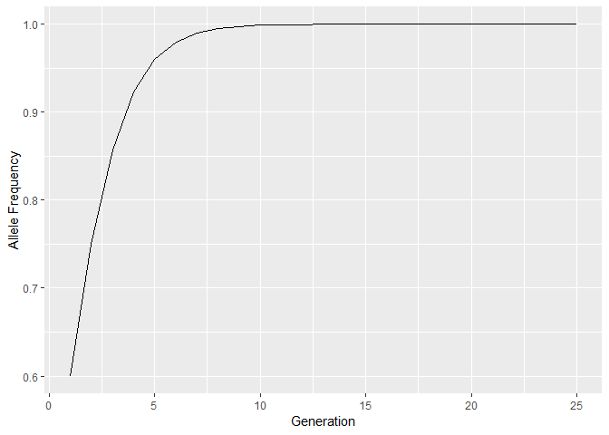

```r
# Loading packages
library(ggplot2)
library(reshape)
```

# 1. 
### Notes can be found on [my repo](link).

# 2.


ptt = freq. A allele in generation t+1
pt = allele freq. of A in generation t
qt = allele freq. of a in generation t
p2 = genotypic freq. for AA in gen. t
WAA = fitness genotype AA
WAa = fitness genotype Aa
Waa = fitness genotype aa
n = number of generations

Note: pt + qt = 1
Note: pt^2 + 2*pt*qt + qt^2 = 1
Note: mean fitness (w_bar) changes, but W(A/a)(A/a) does not


### Following at minimum:
- Report whether beneficial allele fixes
- Plot trajectory of beneficial allele across generations


```r
# For one generation
p0 <- 1
q0 <- 1 - p0
WAA <- 2
WAa <- 0.6
Waa <- 0.4

w_bar <- (p0^2)*WAA + 2*p0*q0*WAa + (q0^2)*Waa
p1 <- (p0^2)*(WAA/w_bar) + p0*q0*(WAa/w_bar)

w_bar
```

```
## [1] 2
```

```r
p1 #allele freq t+1
```

```
## [1] 1
```


### Arguements:
- n = number of generations
- p0 = initial allele A freq. (will use to calulate q0 as (1 - p0))
- WAA = fitness genotype AA
- WAa = fitness genotype Aa
- Waa = fitness genotype aa

Test case:
n <- 10
p0 <- 0.6
WAA <- 2
WAa <- 1
Waa <- 0.5


```r
diploid_selection <- function(p0, n, WAA, WAa, Waa){
# Initialize vectors to store allele frequencies and mean fitness
p <- rep(NA, n) # allele freq. A
q <- rep(NA, n)
gen <- c(1:n)

w_bar <- rep(NA, n)
     
# starting conditions
p[1] <- p0 # starting allele frequencies
q[1] <- 1 - p0 #q0 (have 1 - p0 as default)

# mean fitnesses
w_bar[1] <- ((p[1]^2)*WAA) + (2*p[1]*q[1]*WAa) + (q[1]^2)*Waa

# loop for n generations	
for (i in 2:n) {
		w_bar[i - 1] <- (p[i - 1]^2)*WAA + 2*p[i - 1]*q[i - 1]*WAa + (q[i - 1]^2)*Waa
		
		p[i] <- (p[i - 1]^2)*(WAA/w_bar[i - 1]) + p[i - 1]*q[i - 1]*(WAa/w_bar[i - 1])
		q[i] <- 1 - p[i]
		
	}
    # return(p)

# For determining fixed allele
if (p[n] > 0.9999) {print("Allele is fixed.")} else {print("Allele is not fixed (p < 1).")}

# For plotting
ggplot(NULL, aes(x = gen, y = p)) + geom_line() + xlab("Generation") + ylab("Allele Frequency") 
}

diploid_selection(0.5, 10, 2, 1, 0.5)
```

```
## [1] "Allele is not fixed (p < 1)."
```

<!-- -->

```r
diploid_selection(0.2, 100, 1, 0.5, 2)
```

```
## [1] "Allele is not fixed (p < 1)."
```

<!-- -->

```r
diploid_selection(0.6, 25, 2, 1, 0.5)
```

```
## [1] "Allele is fixed."
```

<!-- -->

# 3.


```r
set.seed(720)
```


### Arguements:
- indiv = number of individuals (2*indiv = number of alleles)
- n = number of generations
- p0 = starting allele frequency for A (1 - p0 = q0; starting for a)

Note: plot allele freq. changes over time


```r
#One generation
allele_count <- sample(c("p", "q"), size = 40, replace = TRUE, prob = c(0.5, 0.5))


allele_1 <- table(allele_count)/length(allele_count)
allele_1
```

```
## allele_count
##   p   q 
## 0.4 0.6
```


```r
# Loop into next generation

allele_count <- sample(c("A", "a"), size = 40, replace = TRUE, prob = c(0.5, 0.5))
allele_1 <- table(allele_count)/length(allele_count)
allele_1
```

```
## allele_count
##   a   A 
## 0.5 0.5
```

```r
allele_count2 <- sample(c("A", "a"), size = 40, replace = T, prob = as.vector(allele_1))
allele_2 <- table(allele_count2)/length(allele_count2)
allele_2
```

```
## allele_count2
##     a     A 
## 0.525 0.475
```


```r
# Looping for n generations
# indiv <- 20
# pA <- 0.5
# qa <- 1 - pA
# n = 10

genetic_drift <- function(pA, n, indiv){
p <- rep(NA, n) #A, the allele of interest
#q <- rep(NA, n) #a
gen <- c(1:n)

p[1] <- pA
#q[1] <- 1 - pA

#loop
for (i in 2:n) {
  allele_count <- sample(factor(c("p", "q")), size = (2*indiv), replace = TRUE, prob = c(pA, (1 - pA)))
  allele_update <- table(allele_count)/length(allele_count)
  p[i] <- as.vector(allele_update)[1]
  #q[i] <- as.vector(allele_update)[2]
  pA <- as.vector(allele_update)[1]
  #qa <- as.vector(allele_update)[2]
  }

# plotting
ggplot(NULL, aes(x = gen, y = p)) + geom_line() + xlab("Generation") + ylab("Allele Frequency")
}

genetic_drift(pA = 0.5, n = 100, indiv = 20)
```

<!-- -->

```r
genetic_drift(0.7, 100, 20)
```

<!-- -->

```r
genetic_drift(0.2, 100, 20)
```

<!-- -->


# 4.
Now that you have a working simulator of genetic drift, you want to use it to assess *how likely it is for the allele to be lost (p = 0) after a certain number of generations* of drift (we will use *100 generations*, but your function should be flexible). Using your function (you can modify it if you need to), *perform a simulation 1000 times* each with starting *allele frequencies of p = f(A) of 0.5, 0.25 and 0.1, with 200 diploid individuals in the population each generation*. 

Have your function record the proportion (out of 1000) of simulated runs that the A allele is lost from the population (p = 0).


```r
set.seed(720)

genetic_drift_track <- function(pA, n, indiv){
p <- rep(NA, n) #A, the allele of interest
#q <- rep(NA, n) #a
gen <- c(1:n)

p[1] <- pA
#q[1] <- 1 - pA

#loop
for (i in 2:n) {
  allele_count <- sample(factor(c("p", "q")), size = (2*indiv), replace = TRUE, prob = c(pA, 1 - pA))
  allele_update <- table(allele_count)/length(allele_count)
  p[i] <- as.vector(allele_update)[1]
  #q[i] <- as.vector(allele_update)[2]
  pA <- as.vector(allele_update)[1]
  #qa <- as.vector(allele_update)[2]
  }
return(p[n] < 0.0001000) # return whether the allele is lost 
}

genetic_drift_sim <- function(s, p, n, indiv){
  track <- replicate(s, genetic_drift_track(pA = p, n = n, indiv = indiv))
  #return(list(table(track), sum(track)/s))
  return(sum(track)/s) # sum count of lost allele
  }


genetic_drift_sim(1000, 0.5, 100, 200) # allele freq = 0.5
```

```
## [1] 0.011
```

```r
genetic_drift_sim(1000, 0.25, 100, 200) # allele freq = 0.25
```

```
## [1] 0.106
```

```r
genetic_drift_sim(1000, 0.1, 100, 200) # allele freq = 0.1
```

```
## [1] 0.407
```


# 5.
Write some code that allows you to plot the allele trajectories for drift for 100 of the simulations starting at p = 0.5.


```r
set.seed(720)

genetic_drift_track2 <- function(pA, n, indiv){
p <- rep(NA, n) #A, the allele of interest
#q <- rep(NA, n) #a
gen <- c(1:n)

p[1] <- pA
#q[1] <- 1 - pA
p_track <- rep

#loop
for (i in 2:n) {
  allele_count <- sample(factor(c("p", "q")), size = (2*indiv), replace = TRUE, prob = c(pA, 1 - pA))
  allele_update <- table(allele_count)/length(allele_count)
  p[i] <- as.vector(allele_update)[1]
  #q[i] <- as.vector(allele_update)[2]
  pA <- as.vector(allele_update)[1]
  #qa <- as.vector(allele_update)[2]
  }
p[1:n] #return p
}

genetic_drift_simplot <- function(s, p, n, indiv){
    gen <- c(1:n)
    sim <- genetic_drift_track2(pA = p, n = n, indiv = indiv)
    A <- data.frame(sim, sim) # first 2 simulatations
    for (i in 3:s) { # loop starts at column 3 until s
      A[,i] <- genetic_drift_track2(pA = p, n = n, indiv = indiv)
    }
   A_sim <- melt(A) # 10000 observations
   ggplot(A_sim, aes(x = rep(c(1:n), s), y = value, colour = variable)) + geom_line() + xlab("Generation") +  ylab("Allele Frequency") + theme(legend.position = "none") 
}

genetic_drift_simplot(100, 0.5, 100, 200)
```

```
## Using  as id variables
```

<!-- -->

```r
genetic_drift_simplot(50, 0.2, 200, 100)
```

```
## Using  as id variables
```

<!-- -->


# 6.

First re-write this as a function where the intercept, slope, sample size (number of observations) and residual standard error (the stochastic variation) are all arguments in the function, so that they can be changed easily to different values. Check that it works. How can you confirm (given this is stochastic) that you can get the same results whether it is in the code I wrote above or the function you wrote?


```r
set.seed(720)

#Before
x <- seq(from =1, to = 10, length.out = 20) # length.out is how many observations we will have
a <- 0.5 # intercept
b <- 0.1 # slope
y_deterministic <- a + b*x
y_simulated <- rnorm(length(x), mean = y_deterministic, sd = 2)
mod_sim <- lm(y_simulated ~ x)
p_val_slope <- summary(mod_sim)$coef[2,4] # extracts the p-value
p_val_slope
```

```
## [1] 0.3620625
```


```r
set.seed(720)  # re-run seed so that first "random" set is consistent, for replication

#After = function
power_analysis <- function(a, b, obs, sd){
  x <- seq(from =1, to = 10, length.out = obs) # length.out is how many observations we will have
  a <- a # intercept
  b <- b # slope
  y_deterministic <- a + b*x
  y_simulated <- rnorm(length(x), mean = y_deterministic, sd = sd)
  mod_sim <- lm(y_simulated ~ x)
  p_val_slope <- summary(mod_sim)$coef[2,4] # extracts the p-value
  p_val_slope
}

power_analysis(0.5, 0.1, 20, 2)
```

```
## [1] 0.3620625
```

Now with your new function, run it 1000 times and generate a histogram of the p-values from these simulations? Check what proportion of times the p-value was less than 0.05.


```r
set.seed(720)
power_analysis_1000 <- replicate(1000, power_analysis(0.5, 0.1, 20, 2))

hist(power_analysis_1000)
```

<!-- -->

```r
less_0.05 <- (table(power_analysis_1000 < 0.05)/length(power_analysis_1000))[["TRUE"]]
less_0.05 # The proportion of observations with p < 0.05
```

```
## [1] 0.107
```

Redo this, but change the slope to 0. Examine this histogram and determine the proportion of times that the p-value is less than 0.05. Explain this result.


```r
set.seed(720)
power_analysis_1000_0 <- replicate(1000, power_analysis(0.5, 0, 20, 2))

hist(power_analysis_1000_0)
```

<!-- -->

```r
less_0.05_0 <- (table(power_analysis_1000_0 < 0.05)/length(power_analysis_1000))[["TRUE"]]
less_0.05_0 # The proportion of observations with p < 0.05
```

```
## [1] 0.061
```


*Explanation for above*: Given that a slope of 0 is a striaght horizontal line, the y_determistic variable is constant (= intercept = 0.5). This maintains the mean of the normal distribution which is much larger than 0.05, reducing the proportion of p-values < 0.05.


Finally, using either a for loop or an Rish method (i.e. one of the apply family of functions) try a grid of sample sizes from 10 to 100 by 5 (i.e. 10, 15, 20. . . ., 95, 100) with the slope being fixed at 0.1, intercept = 0.5 and residual standard error as 1.5. At each different sample size, run the simulation 100 times and report the frequency at which the p value is less than 0.05. What pattern do you observe. Plotting the proportion of p-values less than 0.05 on the Y axis VS sample size (X axis) may be very helpful


```r
set.seed(720)

power_analysis_grid <- function(size, r) {
  power_analysis_100 <- replicate(r, power_analysis(0.5, 0.1, size, 1.5))
  less_0.05_100 <- (table(power_analysis_100 < 0.05)/length(power_analysis_100))[["TRUE"]]
  less_0.05_100 # The proportion of observations with p < 0.05
}


grid <- seq(10, 100, by = 5)
sapply(grid, power_analysis_grid, r = 100)
```

```
##  [1] 0.12 0.12 0.11 0.12 0.21 0.25 0.27 0.20 0.23 0.17 0.31 0.25 0.33 0.42
## [15] 0.33 0.41 0.39 0.42 0.46
```

```r
y <- sapply(grid, power_analysis_grid, r = 100)

ggplot(NULL, aes(x = grid, y = y)) + geom_point() + xlab("Sample Size") + ylab("p < 0.05")
```

<!-- -->

As we increase the sample size, the proportion of p-values < 0.05 increase. This makes sense as we increase reliability and narrow the margin of error with larger sample sizes.
