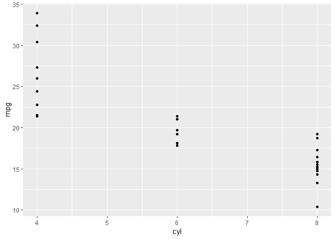
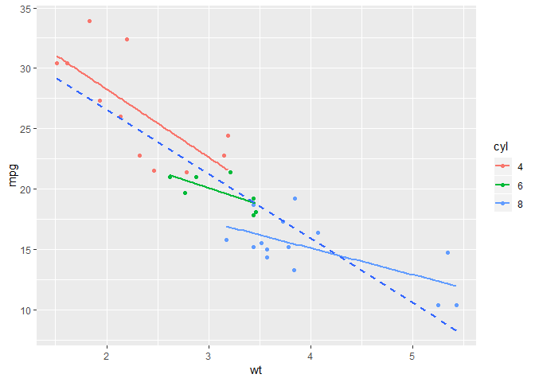
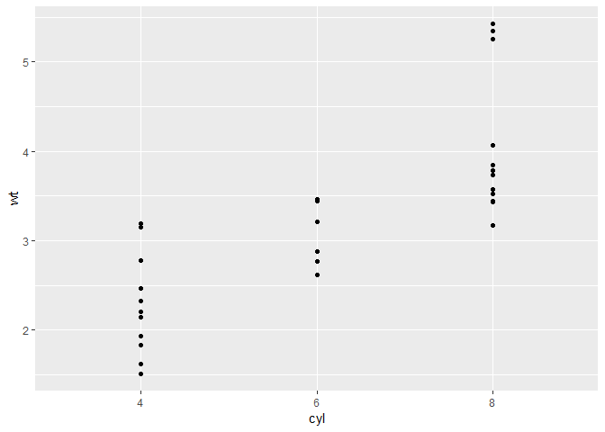

# Data Visualization with ggplot2 (Part 1)

## Goal: outline concepts, data, aesthetics and geometries
  
mtcars dataset contains information about 32 cars from a 1973 Motor Trend magazine. This dataset is small, intuitive, and contains a variety of continuous and categorical variables.


```r
# Load the ggplot2 package
library(ggplot2)

# Explore the mtcars data frame with str()
str(mtcars)
```

```
## 'data.frame':	32 obs. of  11 variables:
##  $ mpg : num  21 21 22.8 21.4 18.7 18.1 14.3 24.4 22.8 19.2 ...
##  $ cyl : num  6 6 4 6 8 6 8 4 4 6 ...
##  $ disp: num  160 160 108 258 360 ...
##  $ hp  : num  110 110 93 110 175 105 245 62 95 123 ...
##  $ drat: num  3.9 3.9 3.85 3.08 3.15 2.76 3.21 3.69 3.92 3.92 ...
##  $ wt  : num  2.62 2.88 2.32 3.21 3.44 ...
##  $ qsec: num  16.5 17 18.6 19.4 17 ...
##  $ vs  : num  0 0 1 1 0 1 0 1 1 1 ...
##  $ am  : num  1 1 1 0 0 0 0 0 0 0 ...
##  $ gear: num  4 4 4 3 3 3 3 4 4 4 ...
##  $ carb: num  4 4 1 1 2 1 4 2 2 4 ...
```

```r
#Plot
ggplot(mtcars, aes(x = cyl, y = mpg)) +
  geom_point()
```

<!-- -->

Cyl (the number of cylinders is categorical, but classified as numeric)


```r
# cyl is treated as factor
ggplot(mtcars, aes(x = factor(cyl), y = mpg)) +
  geom_point()
```

<!-- -->

Notice the y-axis has changed.

**Grammar**

Can assign plot to object and continue to add additional layers on top.


```r
# Create the object containing the data and aes layers: dia_plot
dia_plot <- ggplot(diamonds, aes(x = carat, y = price))

# Add a geom layer with + and geom_point()
dia_plot + geom_point()
```

<!-- -->

```r
# Add the same geom layer, but with aes() inside
dia_plot + geom_point(aes(color = clarity))
```

<!-- -->


```r
# 1 - The dia_plot object has been created for you
dia_plot <- ggplot(diamonds, aes(x = carat, y = price))

# 2 - Expand dia_plot by adding geom_point() with alpha set to 0.2
dia_plot <- dia_plot + geom_point(alpha = 0.2)

# 3 - Plot dia_plot with additional geom_smooth() with se set to FALSE
# se = F to avoid error shading
dia_plot + geom_smooth(se = FALSE)
```

```
## `geom_smooth()` using method = 'gam' and formula 'y ~ s(x, bs = "cs")'
```

<!-- -->

```r
# 4 - Copy the command from above and add aes() with the correct mapping to geom_smooth()
dia_plot + geom_smooth(aes(col = clarity), se = FALSE)
```

```
## `geom_smooth()` using method = 'gam' and formula 'y ~ s(x, bs = "cs")'
```

<!-- -->


## Data

Review of base R plotting:

You want to make a plot of mpg (miles per gallon) against wt (weight in thousands of pounds) in the mtcars data frame, but this time you want the dots colored according to the number of cylinders, cyl. How?

You can use a little trick to color the dots by specifying a factor variable as a color. This works because factors are just a special class of the integer type.


```r
# Plot the correct variables of mtcars
plot(mtcars$wt, mtcars$mpg, col = mtcars$cyl)
```

<!-- -->

```r
# Change cyl inside mtcars to a factor
mtcars$fcyl <- as.factor(mtcars$cyl)

# Make the same plot as in the first instruction
plot(mtcars$wt, mtcars$mpg, col = mtcars$fcyl)
```

<!-- -->

Exercise:

In this exercise you'll recreate the base package plot in ggplot2.

```r
# Convert cyl to factor (don't need to change)
mtcars$cyl <- as.factor(mtcars$cyl) 

# Example from base R (don't need to change)
plot(mtcars$wt, mtcars$mpg, col = mtcars$cyl)
abline(lm(mpg ~ wt, data = mtcars), lty = 2)
lapply(mtcars$cyl, function(x) {
  abline(lm(mpg ~ wt, mtcars, subset = (cyl == x)), col = x)
  })
```

```
## [[1]]
## NULL
## 
## [[2]]
## NULL
## 
## [[3]]
## NULL
## 
## [[4]]
## NULL
## 
## [[5]]
## NULL
## 
## [[6]]
## NULL
## 
## [[7]]
## NULL
## 
## [[8]]
## NULL
## 
## [[9]]
## NULL
## 
## [[10]]
## NULL
## 
## [[11]]
## NULL
## 
## [[12]]
## NULL
## 
## [[13]]
## NULL
## 
## [[14]]
## NULL
## 
## [[15]]
## NULL
## 
## [[16]]
## NULL
## 
## [[17]]
## NULL
## 
## [[18]]
## NULL
## 
## [[19]]
## NULL
## 
## [[20]]
## NULL
## 
## [[21]]
## NULL
## 
## [[22]]
## NULL
## 
## [[23]]
## NULL
## 
## [[24]]
## NULL
## 
## [[25]]
## NULL
## 
## [[26]]
## NULL
## 
## [[27]]
## NULL
## 
## [[28]]
## NULL
## 
## [[29]]
## NULL
## 
## [[30]]
## NULL
## 
## [[31]]
## NULL
## 
## [[32]]
## NULL
```

```r
legend(x = 5, y = 33, legend = levels(mtcars$cyl),
       col = 1:3, pch = 1, bty = "n")
```

<!-- -->

```r
# Plot 1: add geom_point() to this command to create a scatter plot
ggplot(mtcars, aes(x = wt, y = mpg, col = cyl)) +
  geom_point()  # Fill in using instructions Plot 1
```

<!-- -->

```r
# Plot 2: include the lines of the linear models, per cyl
ggplot(mtcars, aes(x = wt, y = mpg, col = cyl)) +
  geom_point() + # Copy from Plot 1
  geom_smooth(method = lm, se = FALSE)   # Fill in using instructions Plot 2
```

<!-- -->

```r
# Plot 3: include a lm for the entire dataset in its whole
ggplot(mtcars, aes(x = wt, y = mpg, col = cyl)) +
  geom_point() + # Copy from Plot 2
  geom_smooth(method = lm, se = FALSE) + # Copy from Plot 2
  geom_smooth(aes(group = 1), method = lm, se = FALSE, linetype = 2)   # Fill in using instructions Plot 3
```

<!-- -->

# Rearranging data for visualization using tidyr


```r
# Load the tidyr package
library(tidyr)

# produce to the correct iris.tidy dataset
iris.tidy <- iris %>%
  gather(key, Value, -Species) %>%
  separate(key, c("Part", "Measure"), "\\.")

#compare
head(iris)
```

```
##   Sepal.Length Sepal.Width Petal.Length Petal.Width Species
## 1          5.1         3.5          1.4         0.2  setosa
## 2          4.9         3.0          1.4         0.2  setosa
## 3          4.7         3.2          1.3         0.2  setosa
## 4          4.6         3.1          1.5         0.2  setosa
## 5          5.0         3.6          1.4         0.2  setosa
## 6          5.4         3.9          1.7         0.4  setosa
```

```r
head(iris.tidy)
```

```
##   Species  Part Measure Value
## 1  setosa Sepal  Length   5.1
## 2  setosa Sepal  Length   4.9
## 3  setosa Sepal  Length   4.7
## 4  setosa Sepal  Length   4.6
## 5  setosa Sepal  Length   5.0
## 6  setosa Sepal  Length   5.4
```

The *gather()* function moves information from the columns to the rows. It takes multiple columns and gathers them into a single column by adding rows. The *separate()* function splits one column into two or more columns according to a pattern you define. 

#Aesthetics

These are the aesthetics you can consider within aes() in this chapter: x, y, color, fill, size, alpha, labels and shape.


```r
# 4 - Change shape and size of the points in the above plot
ggplot(mtcars, aes(x = wt, y = mpg, color = cyl)) +
  geom_point(shape = 1, size = 4)
```

<!-- -->

**Which shape to use?** The default geom_point() uses shape = 19 (a solid circle with an outline the same colour as the inside). 

Good alternatives are shape = 1 (hollow) and shape = 16 (solid, no outline). These all use the col aesthetic (don't forget to set alpha for solid points).

A really nice alternative is shape = 21 which allows you to use both fill for the inside and col for the outline! 

Shapes in R can have a value from 1-25. Shapes 1-20 can only accept a color aesthetic, but shapes 21-25 have both a color and a fill aesthetic. See the pch argument in par() for further discussion.


```r
# 3 - Map am to col in the above plot
ggplot(mtcars, aes(x = wt, y = mpg, fill = cyl, col = am)) +
  geom_point(shape = 21, size = 4, alpha = 0.6)
```

<!-- -->

# Attributes

You can use all the aesthetics as attributes. Let's see how this works with the aesthetics you used in the previous exercises: x, y, color, fill, size, alpha, label and shape. These are outside the *aes()*, part of *geom_?*

Position can alter how data is displayed.
"stack" (overlap), "fill" (propotions filling graph), "dodge" (offset).


```r
cyl.am <- ggplot(mtcars, aes(x = factor(cyl), fill = factor(am)))

cyl.am + geom_bar() #position = "stack" by default
```

<!-- -->

```r
# Fill - show proportion
cyl.am + geom_bar(position = "fill")  
```

<!-- -->

```r
# Dodging - principles of similarity and proximity
cyl.am + geom_bar(position = "dodge") 
```

<!-- -->


#Overplotting

Occurs when:
1. Large datasets
2. Imprecise data and so points are not clearly separated on your plot (you saw this in the video with the iris dataset)
3. Interval data (i.e. data appears at fixed values)
4. Aligned data values on a single axis


Technique: solid shapes + alpha blending


```r
# Basic scatter plot: wt on x-axis and mpg on y-axis; map cyl to col
ggplot(mtcars, aes(x = wt, y = mpg, color = cyl)) + geom_point(size = 4)
```

<!-- -->

```r
# Hollow circles - an improvement
ggplot(mtcars, aes(x = wt, y = mpg, color = cyl)) + geom_point(size = 4, shape = 1)
```

<!-- -->

```r
# Add transparency - very nice
ggplot(mtcars, aes(x = wt, y = mpg, color = cyl)) + geom_point(size = 4, shape = 1, alpha = 0.6)
```

<!-- -->

#Geometries

###Scatter Plots


```r
# Basic
ggplot(mtcars, aes(x = cyl, y = wt)) +
  geom_point()
```

<!-- -->

```r
# With geom_jitter() #default position = "jitter"
ggplot(mtcars, aes(x = cyl, y = wt)) +
  geom_jitter()
```

<!-- -->

```r
# 2 - Set width in geom_jitter() #can modify
ggplot(mtcars, aes(x = cyl, y = wt)) +
  geom_jitter(width = 0.1)
```

<!-- -->

```r
# 3 - Set position = position_jitter() in geom_point() ()
ggplot(mtcars, aes(x = cyl, y = wt)) +
  geom_point(position = position_jitter(0.1))
```

<!-- -->

###Histograms

**The x axis/aesthetic:** The documentation for geom_histogram() states the argument stat = "bin" as a default. Recall that histograms cut up a continuous variable into discrete bins - that's what the stat "bin" is doing. You always get 30 evenly-sized bins by default, which is specified with the default argument binwidth = range/30.


**The y axis/aesthetic:** geom_histogram() only requires one aesthetic: x. But there is clearly a y axis on your plot, so where does it come from? Actually, there is a variable mapped to the y aesthetic, it's called ..count... (internal dataframe). Can call other functions like ..density..


```r
# 1 - Make a univariate histogram
ggplot(mtcars, aes(x = mpg)) + geom_histogram()
```

```
## `stat_bin()` using `bins = 30`. Pick better value with `binwidth`.
```

<!-- -->

```r
# 2 - Plot 1, plus set binwidth to 1 in the geom layer
ggplot(mtcars, aes(x = mpg)) + geom_histogram(binwidth = 1) 
```

<!-- -->

```r
# 3 - Plot 2, plus MAP ..density.. to the y aesthetic (i.e. in a second aes() function)
ggplot(mtcars, aes(x = mpg)) + geom_histogram(binwidth = 1, aes(y = ..density..)) 
```

<!-- -->

**Positions**
Three position arguments will be introduced here:
.	stack: place the bars on top of each other. Counts are used. This is the default position.
.	fill: place the bars on top of each other, but this time use proportions.
.	dodge: place the bars next to each other. Counts are used. (preferred)


```r
# Draw a bar plot of cyl, filled according to am
ggplot(mtcars, aes(x = cyl, fill = am)) + geom_bar()
```

<!-- -->

```r
# Change the position argument to stack
ggplot(mtcars, aes(x = cyl, fill = am)) + geom_bar(position = "stack")
```

<!-- -->

```r
# Change the position argument to fill
ggplot(mtcars, aes(x = cyl, fill = am)) + geom_bar(position = "fill")
```

<!-- -->

```r
# Change the position argument to dodge
ggplot(mtcars, aes(x = cyl, fill = am)) + geom_bar(position = "dodge")
```

<!-- -->

Overlapping histograms pose similar problems to overlapping bar plots, but there is a unique solution here: a frequency polygon geom_freqpoly().


```r
# A basic histogram, add coloring defined by cyl
ggplot(mtcars, aes(mpg, fill = cyl)) + geom_histogram(binwidth = 1)
```

<!-- -->

```r
# Change geom to freqpoly (position is identity by default)
ggplot(mtcars, aes(mpg, col = cyl)) + geom_freqpoly(binwidth = 1)
```

<!-- -->

###Line Plots


```r
# Print out head of economics
head(economics)
```

```
## # A tibble: 6 x 6
##   date         pce    pop psavert uempmed unemploy
##   <date>     <dbl>  <int>   <dbl>   <dbl>    <int>
## 1 1967-07-01  507. 198712    12.5     4.5     2944
## 2 1967-08-01  510. 198911    12.5     4.7     2945
## 3 1967-09-01  516. 199113    11.7     4.6     2958
## 4 1967-10-01  513. 199311    12.5     4.9     3143
## 5 1967-11-01  518. 199498    12.5     4.7     3066
## 6 1967-12-01  526. 199657    12.1     4.8     3018
```

```r
# Plot unemploy as a function of date using a line plot
ggplot(economics, aes(x = date, y = unemploy)) + geom_line()
```

<!-- -->

```r
# Adjust plot to represent the fraction of total population that is unemployed
ggplot(economics, aes(x = date, y = unemploy/pop)) + geom_line()
```

<!-- -->


###qplot

Shorcut for "quick and dirty"" plots.


```r
# The old way (shown)
plot(mpg ~ wt, data = mtcars) # formula notation
```

<!-- -->

```r
with(mtcars, plot(wt, mpg)) # x, y notation
```

<!-- -->

```r
# Using ggplot:
ggplot(mtcars, aes(x = wt, y = mpg)) + geom_point()
```

<!-- -->

```r
# Using qplot: assumes geom_?, in this case geom_point()
qplot(wt, mpg, data = mtcars)
```

<!-- -->

```r
# Using aesthetics
qplot(wt, mpg, data = mtcars, color = hp)
```

<!-- -->

```r
# qplot() with geom set to jitter manually
qplot(factor(cyl), factor(vs), data = mtcars) #before
```

<!-- -->

```r
qplot(factor(cyl), factor(vs), data = mtcars, geom = "jitter") #after
```

<!-- -->

